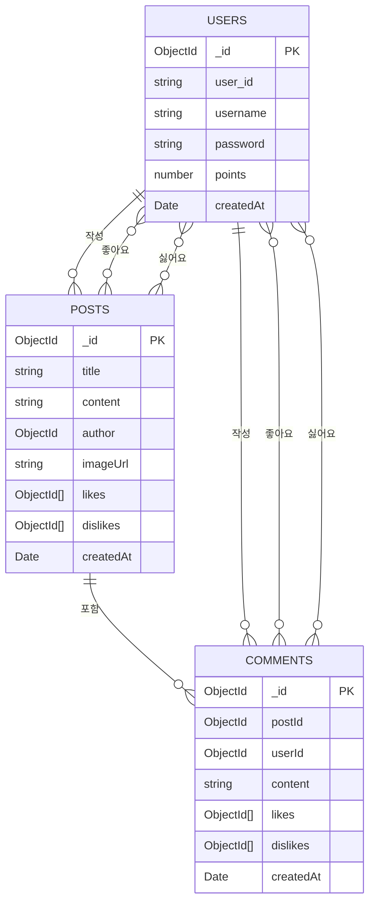

# H - 통합 커뮤니케이션 웹 플랫폼

누구나 자유롭게 게시글을 작성하고 댓글과 좋아요로 소통할 수 있는 커뮤니티 서비스입니다.

> [프로젝트 문서](https://tl9434.notion.site/CryptoFolio-229857f733818008bc5ff076fcc8a16f?pvs=74)

## 🚀 주요 기능

### 🔑 유저 인증/프로필관리
- **회원가입 및 로그인**
- **프로필 관리** (닉네임/비밀번호 변경, 회원 탈퇴)

### 📝 게시글 및 댓글 관리
- **게시글 CRUD** (작성, 조회, 수정, 삭제)
- **댓글 CRUD** (게시글 내 댓글 작성, 조회, 수정, 삭제)
- **좋아요 및 싫어요** (게시글과 댓글에 적용)

### 🏆 포인트 시스템
- **유저 활동에 따른 포인트 증감**
- **포인트 구간별 동물 아이콘 매핑**

### 📸 이미지 및 파일 업로드
- **Cloudinary를 활용한 이미지 업로드 및 파일 저장**

## 🛠 기술 스택

### **프론트엔드**
- React, TypeScript
- Zustand, Context API
- MUI (UI 라이브러리)

### **백엔드**
- Node.js (Express)
- MongoDB Atlas
- JWT, bcrypt
- Cloudinary, Multer

## 📂 데이터베이스 구조

## 7. 배포

- **프론트엔드**
  - Vercel
  - 배포 URL: [https://h-two-iota.vercel.app](https://h-two-iota.vercel.app)

- **백엔드**
  - Render (Node 서버 배포)
  - 배포 URL: [https://h-6yo4.onrender.com](https://h-6yo4.onrender.com)
