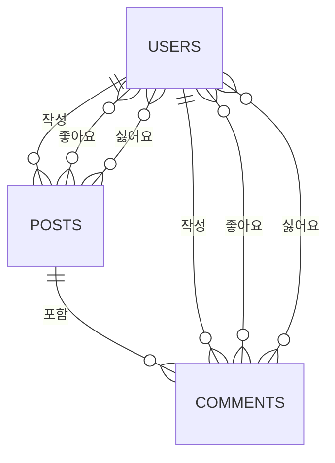

# H - 통합 커뮤니케이션 웹 플랫폼

H는 누구나 쉽게 게시글을 작성하고, 댓글과 좋아요를 통해 소통할 수 있는 커뮤니케이션 웹사이트입니다. 이미지 및 파일 업로드 기능을 통해 다양한 콘텐츠를 공유할 수 있으며, 유저 활동에 따라 가상의 포인트를 획득할 수 있습니다.

## 🚀 주요 기능

### 🔑 회원 관리
- **회원가입 및 로그인** (JWT 인증)
- **프로필 관리** (닉네임/비밀번호 변경, 회원 탈퇴)

### 📝 게시글 및 댓글 관리
- **게시글 CRUD** (작성, 조회, 수정, 삭제)
- **댓글 CRUD** (게시글에 대한 댓글 작성, 조회, 수정, 삭제)
- **좋아요 및 싫어요** (게시글과 댓글에 적용)

### 📸 이미지 및 파일 업로드
- **Cloudinary를 활용한 이미지 업로드 및 파일 저장**

### 🏆 포인트 시스템
- **활동에 따른 포인트 획득 및 감소**
- **포인트에 따른 동물 아이콘 표시**

## 🛠 기술 스택

### **프론트엔드**
- React (TypeScript)
- Zustand (상태 관리)
- MUI (UI 라이브러리)
- React Router
- Axios

### **백엔드**
- Node.js (Express)
- MongoDB Atlas
- JWT 인증
- bcrypt (비밀번호 암호화)
- Cloudinary (이미지 파일 관리)

## 📂 데이터베이스 구조
MongoDB를 사용하여 유저, 게시글, 댓글 등의 데이터를 저장합니다.

## 7. 배포

- **프론트엔드**
  - Vercel (자동 배포 및 CDN 제공)
  - 배포 URL: [https://h-two-iota.vercel.app](https://h-two-iota.vercel.app)

- **백엔드**
  - Render (Node 서버 배포)
  - 배포 URL: [https://h-6yo4.onrender.com](https://h-6yo4.onrender.com)
  - **참고**: Render 무료 요금제의 경우 일정 시간(약 15분) 동안 사용자가 접속하지 않으면 서버가 자동으로 슬립 모드에 들어갑니다.  
